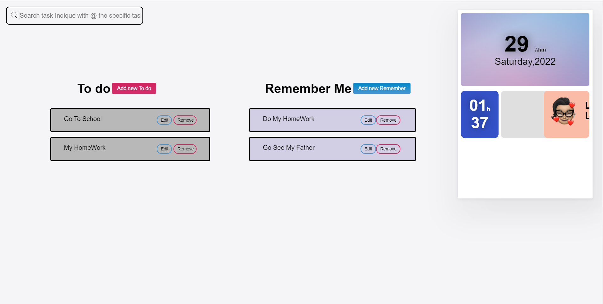
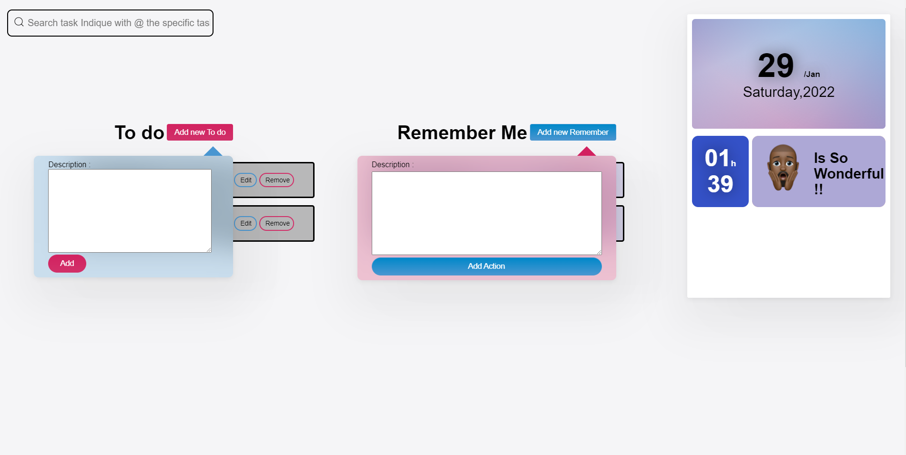

# Task 
----

----

Applications of management of the unipersonal activities of an internet user. Create for the purpose of angular book, improved version and implemented for a simple design.

Applications de gestion des activités unipersonnelle d'un internaute.
Créer dans le but d'une `application du cour d'angular`, version ameliorée et mise en oeuvre pour un design simple.

This project was generated with [Angular CLI](https://github.com/angular/angular-cli) version 13.0.2.

Author `Guemkan Dietrich web developper JAVA/PHP(SYMFONY,CODEIGNITER)/ C++ and QT/JS(ANGULAR)//FLUTTER. LOve innovative code and innovative tech. LOve devos. Love architect system and soft`
